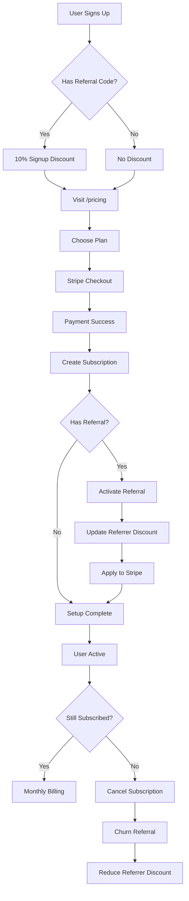

# Stripe Payment & Subscription Setup Guide

## 🎯 Overview

Complete payment flow for Tradie Receptionist with:
- 3 pricing tiers (Starter, Professional, Premium)
- Automatic referral discount application (signup + referral rewards)
- Subscription management via Stripe
- Webhook automation for referral activation

## ✅ What's Been Built

### 1. Pricing Page (`/pricing`)
- Shows 3 plans with features
- Calculates and displays discounts in real-time
- Discount banner if user has referral rewards
- Handles 100% discount (FREE) case
- Redirects to Stripe Checkout

### 2. Stripe Checkout Integration
**API:** `/api/stripe/create-checkout`
- Creates Stripe customer (if needed)
- Applies discount coupons automatically
- Redirects to `/dashboard/receptionist/setup` after payment
- Passes metadata for referral tracking

### 3. Webhook Handler
**API:** `/api/stripe/webhook`

Handles 3 events:
- `checkout.session.completed` → Create subscription + activate referral
- `customer.subscription.updated` → Update status + reactivate if needed
- `customer.subscription.deleted` → Cancel subscription + churn referral

### 4. Database Schema
**Migration 009:** `009_stripe_integration.sql`
- Added `stripe_customer_id` to customers table
- Created `subscriptions` table
- Tracks all subscription data and status

## 🚀 Setup Instructions

### Step 1: Create Stripe Products

Go to [Stripe Dashboard → Products](https://dashboard.stripe.com/products)

**Create 3 Products:**

1. **Starter Plan**
   - Name: "AI Receptionist - Starter"
   - Price: $79/month
   - Copy Price ID → `NEXT_PUBLIC_STRIPE_STARTER_PRICE_ID`

2. **Professional Plan** (Most Popular)
   - Name: "AI Receptionist - Professional"
   - Price: $139/month
   - Copy Price ID → `NEXT_PUBLIC_STRIPE_PROFESSIONAL_PRICE_ID`

3. **Premium Plan**
   - Name: "AI Receptionist - Premium"
   - Price: $249/month
   - Copy Price ID → `NEXT_PUBLIC_STRIPE_PREMIUM_PRICE_ID`

### Step 2: Set Up Webhook

Go to [Stripe Dashboard → Webhooks](https://dashboard.stripe.com/webhooks)

**Create endpoint:**
- URL: `https://yeahmate.ai/api/stripe/webhook`
- Events to listen for:
  - `checkout.session.completed`
  - `customer.subscription.updated`
  - `customer.subscription.deleted`

Copy the **Signing Secret** → `STRIPE_WEBHOOK_SECRET`

### Step 3: Environment Variables

Update your `.env` file:

```env
# Stripe
STRIPE_SECRET_KEY=sk_test_xxx  # From Stripe Dashboard → API Keys
NEXT_PUBLIC_STRIPE_PUBLISHABLE_KEY=pk_test_xxx
STRIPE_WEBHOOK_SECRET=whsec_xxx  # From Step 2

# Stripe Price IDs
NEXT_PUBLIC_STRIPE_STARTER_PRICE_ID=price_xxx
NEXT_PUBLIC_STRIPE_PROFESSIONAL_PRICE_ID=price_xxx
NEXT_PUBLIC_STRIPE_PREMIUM_PRICE_ID=price_xxx

# App URL
NEXT_PUBLIC_APP_URL=https://yeahmate.ai  # Or http://localhost:3000 for dev

# Supabase (for webhook to call activate-referral API)
SUPABASE_SERVICE_ROLE_KEY=eyJxxx
```

### Step 4: Apply Database Migration

Go to Supabase SQL Editor:

```sql
-- Paste contents of 009_stripe_integration.sql
```

Verify:
```sql
SELECT stripe_customer_id FROM customers LIMIT 1;
SELECT * FROM subscriptions LIMIT 1;
```

### Step 5: Test the Flow

**Local Testing (with Stripe CLI):**

1. Install Stripe CLI:
   ```bash
   brew install stripe/stripe-cli/stripe
   ```

2. Login:
   ```bash
   stripe login
   ```

3. Forward webhooks to localhost:
   ```bash
   stripe listen --forward-to localhost:3000/api/stripe/webhook
   ```

4. Test checkout:
   - Visit: http://localhost:3000/pricing
   - Sign up with referral code first (to test discounts)
   - Click "Get started" on Professional plan
   - Use test card: `4242 4242 4242 4242`
   - Check console for webhook events

**Test Card Numbers:**
- Success: `4242 4242 4242 4242`
- Decline: `4000 0000 0000 0002`
- Requires 3DS: `4000 0025 0000 3155`

### Step 6: Verify Webhook Processing

After successful payment, verify:

```sql
-- Check subscription was created
SELECT * FROM subscriptions WHERE customer_id = 'xxx';

-- Check referral was activated (if applicable)
SELECT * FROM referrals WHERE referred_customer_id = 'xxx';

-- Check referrer got their discount (if applicable)
SELECT
  name,
  email,
  active_referrals_count,
  referral_discount_percentage
FROM customers
WHERE id = 'referrer_id';
```

## 💡 How the Flow Works

### New Customer Journey

1. **Signup with Referral Code**
   ```
   Visit: yeahmate.ai/signup?ref=TRADE-AB12
   → See banner: "🎉 You've been referred! Get 10% off"
   → Create account
   → Database: signup_discount_percentage = 10, status = pending
   ```

2. **Choose Plan**
   ```
   Visit: /pricing
   → See discount: "$125.10" (crossed out "$139")
   → Click "Get started"
   ```

3. **Stripe Checkout**
   ```
   API creates Checkout Session with:
   - Coupon: 10% off (from signup discount)
   - Success URL: /dashboard/receptionist/setup
   - Metadata: customer_id, referral info
   ```

4. **Payment Success**
   ```
   Webhook: checkout.session.completed
   → Create subscription record
   → Call /api/subscriptions/activate-referral
   → Referral: pending → active
   → Referrer gets +10% discount
   → Both get Stripe coupons applied
   ```

5. **Redirect to Setup**
   ```
   User lands at: /dashboard/receptionist/setup
   → Complete onboarding
   → Start using AI receptionist
   ```

### Referrer Journey

1. **Share Code**
   ```
   Visit: /dashboard/receptionist/referrals
   → Copy code: TRADE-AB12
   → Share with mate
   ```

2. **Mate Signs Up + Subscribes**
   ```
   Webhook activates referral
   → Referrer's active_referrals_count: 0 → 1
   → Referrer's referral_discount_percentage: 0 → 10
   → Stripe subscription updated with new coupon
   ```

3. **Next Billing Cycle**
   ```
   Stripe charges with 10% discount applied
   Original: $139 → Discounted: $125.10
   ```

## 📊 Discount Calculation Examples

### Example 1: New Customer Only
- Signup discount: 10%
- Referral discount: 0%
- **Total: 10% off**
- Professional plan: $139 → **$125.10/month**

### Example 2: New Customer + Referrer with 3 Active Referrals
**New Customer:**
- Signup discount: 10%
- Total: **10% off**
- Pays: **$125.10/month**

**Referrer:**
- Signup discount: 0%
- Referral discount: 40% (4 active referrals × 10%)
- Total: **40% off**
- Pays: **$83.40/month**

### Example 3: Referrer with 10 Active Referrals
- Signup discount: 0%
- Referral discount: 100% (10 × 10%, capped at 100%)
- Total: **100% = FREE**
- Pays: **$0/month** 🎉

## 🔧 Webhook Security

The webhook handler verifies Stripe signatures:

```typescript
const event = stripe.webhooks.constructEvent(
  body,
  signature,
  process.env.STRIPE_WEBHOOK_SECRET!
)
```

**Never** skip signature verification in production!

## 🧪 Testing Checklist

- [ ] Create 3 products in Stripe with correct prices
- [ ] Set up webhook endpoint and copy secret
- [ ] Add all environment variables
- [ ] Apply database migration (009)
- [ ] Test signup with referral code
- [ ] Verify discount shows on pricing page
- [ ] Complete test checkout with Stripe test card
- [ ] Verify subscription created in database
- [ ] Verify referral activated (if applicable)
- [ ] Check referrer's discount increased
- [ ] Test subscription cancellation
- [ ] Verify referral churned and referrer's discount decreased

## 🚨 Common Issues

**Issue: Webhook not receiving events**
- Check webhook URL is correct
- Verify webhook secret matches
- Use Stripe CLI for local testing
- Check Stripe Dashboard → Webhooks → Recent Events

**Issue: Discount not applied**
- Check customer has signup_discount_percentage or referral_discount_percentage > 0
- Verify coupon was created in Stripe
- Check Checkout Session has `discounts` array

**Issue: Referral not activating**
- Verify subscription has customer_id in metadata
- Check /api/subscriptions/activate-referral is accessible
- Look for errors in webhook logs

**Issue: Customer charged full price**
- Ensure coupon was applied to Checkout Session
- Check Stripe Customer has default coupon
- Verify subscription has coupon in Stripe Dashboard

## 📈 Monitoring

**Key Metrics to Track:**

```sql
-- Active subscriptions by plan
SELECT
  metadata->>'plan_id' as plan,
  status,
  COUNT(*) as count,
  SUM(CASE WHEN cancel_at_period_end THEN 1 ELSE 0 END) as cancelling
FROM subscriptions
GROUP BY metadata->>'plan_id', status;

-- Revenue impact of referrals
SELECT
  COUNT(*) FILTER (WHERE signup_discount_percentage > 0) as referred_customers,
  COUNT(*) FILTER (WHERE referral_discount_percentage > 0) as referring_customers,
  AVG(referral_discount_percentage) as avg_referral_discount,
  COUNT(*) FILTER (WHERE referral_discount_percentage = 100) as free_customers
FROM customers;

-- Conversion funnel
SELECT
  COUNT(*) FILTER (WHERE status = 'pending') as pending,
  COUNT(*) FILTER (WHERE status = 'active') as active,
  COUNT(*) FILTER (WHERE status = 'churned') as churned,
  ROUND(
    COUNT(*) FILTER (WHERE status = 'active')::NUMERIC /
    COUNT(*)::NUMERIC * 100,
    2
  ) as conversion_rate
FROM referrals;
```

## 🔄 Subscription Lifecycle



---

**Status:** ✅ Ready for testing
**Next:** Create Stripe products → Test end-to-end flow
